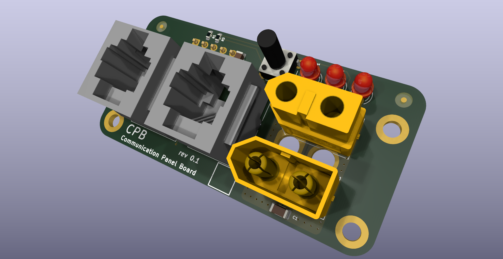

# cpb
Communication panel board

In this repository you will find the `communication panel board` for the [libreUPS](https://github.com/libreUPS) complex.

Includes:
- can (x2)
- power bus (x2)
- LED (x3)
- button (x1)

Currently used in:
- bc1u15s